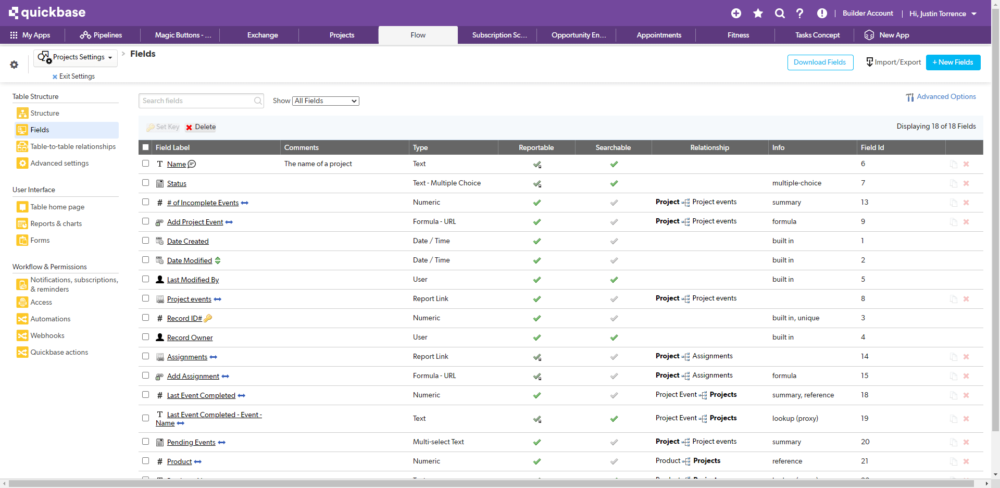
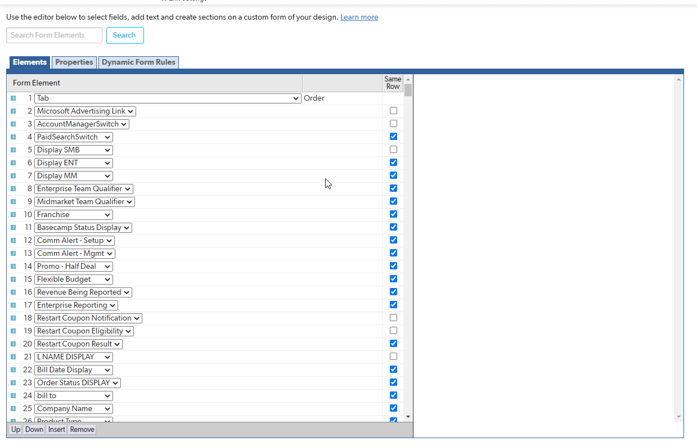
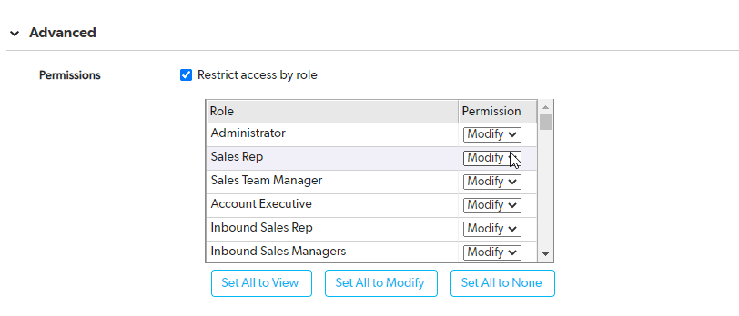
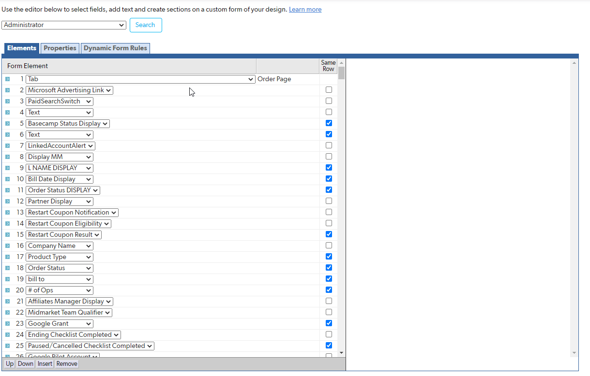
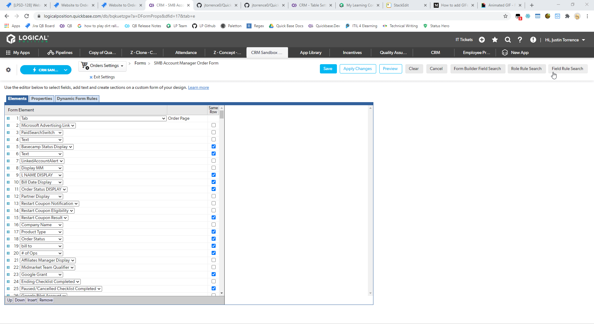
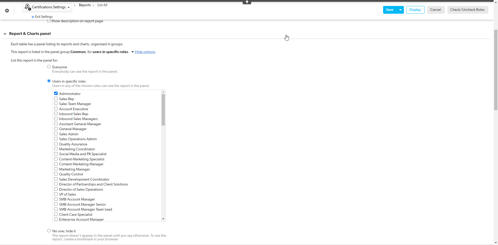

# QuickBaseTamperMonkey
This project contains several [Tampermokey](http://www.tampermonkey.net/) UserScripts that help extend the capability of Quick Base for application administrators
## How to install
1. Install the [Tampermonkey extension](https://www.tampermonkey.net/?ext=dhdg&browser=chrome) for your browser.
2. Navigate to the GitHub page (above) of the UserScript you would like to install and click the **Raw** button on the right side of the page.
3. On the Tampermonkey screen, click the **Install** or **Reinstall** button.
## QuickbaseFieldExport
### What it does
Exports a CSV of all the field info for a table
### Where it can be found
In the field settings
### How to use it
1. Click the button that appears in the top right of the screen called "Download Fields".
2. Open the CSV doc that is downloaded as a result

## QuickBaseFormBuilderSearch
### What it does
Allows for you to search through the "Elements" of a form builder to match text
### Where it can be found
In the form editor
### How to use it
1. Click the button that appears in the top right of the screen called "Form Builder Field Search".
2. Type the text that you would like to search for matches in the Elements tab.
3. Click "Search".
4. If there is a match, the Element who's name matches that text will be selected.
5. Continue clicking Search to look for additional matches.
### Demo

## QuickBaseRestrictRoleAccess
### What it does
Allows for you to Change role permissions of a field in bulk
### Where it can be found
In the field settings screen
### How to use it
1. Click the button that appears in the top right of the screen called "Role Tool".
2. Check the "Restrict access by role" checkbox if not already checked
3. Below the list of roles there will be 3 buttons.
* Set All to View will set the permissions for all of the roles in the list to "View"
* Set All to Modify will set the permissions for all of the roles in the list to "Modify"
* Set All to None will set the permissions for all of the roles in the list to "None"
### Demo

## QuickBaseDynamicRuleRoleSearch
### What it does
Gives you a list of form rules that a given Role is referenced by
### Where it can be found
In the form editor
### How to use it
1. Click the button that appears in the top right of the screen called "Role Rule Search".
2. Select the role that you would like to search for references to in Form Rules in the dropdown that appears above the tabs of the Form Builder.
3. Click "Search".
4. A list of form rule #'s will be displayed below the drop down.
### Demo

## QuickBaseDynamicRuleFieldSearch
### What it does
Gives you a list of all the rules that a given field is used in on the current form
### Where it can be found
In the form editor
### How to use it
1. Click the button that appears in the top right of the screen called **Field Rule Search**.
2. Enter the field ID of the field you would like to see rule usage for in the popup and press okay.
3. A list of form rule #'s will be displayed.

## QuickBaseReportRole
### What it does
Allows for you to configure role permissions of a report in bulk
### Where it can be found
In the report builder
### How to use it
1. Click the button that appears in the top right of the screen called "Check/Uncheck Roles".
2. Expand the Report & Charts panel section
3. If not already selected, click on the "Users in specific roles" radio button
4. Click "Check All Roles" or "Uncheck All Roles" button in the top right
* "Check All Roles" will set the permissions for all of the roles in the list to "Checked"
* "Uncheck All Roles" will set the permissions for all of the roles in the list to "Unchecked"

